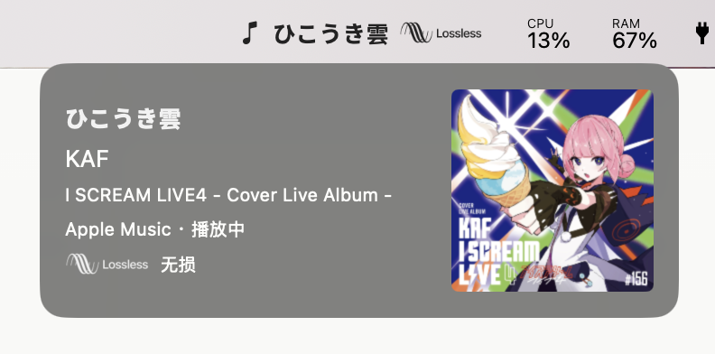
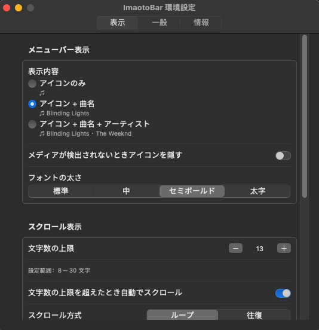

# ImaotoBar（macOS 菜单栏媒体信息工具）

[](https://www.apple.com/macos/)
[](https://www.swift.org/)
[](https://developer.apple.com/xcode/swiftui/)
[](https://polyformproject.org/licenses/noncommercial/1.0.0/)

<p align="center">
  
</p>

<p align="center">
  一个原生、轻量的 macOS 菜单栏应用，用于显示当前正在播放的歌曲信息，让你无需切换到播放器即可快速查看曲目与歌手。
</p>

---

## 简介

**ImaotoBar** 是一款基于 SwiftUI 开发的 macOS 菜单栏媒体信息工具。它可以从 Apple Music 与 Spotify 读取当前播放状态，并将曲目、歌手和可选的音质信息直接显示在菜单栏中。

本项目仍处于积极开发阶段，功能、界面、支持的播放器及构建方式都可能调整。

---

## 特性

- **菜单栏显示**：在菜单栏中显示当前曲目、歌手或两者组合。
- **多播放器支持**：支持 Apple Music 与 Spotify，并优先显示正在播放的内容。
- **可调整优先级**：可在设置中拖动调整多个播放器之间的识别优先级。
- **灵活滚动显示**：长文本可选择省略或滚动显示，支持循环与往返两种滚动方式。
- **显示选项丰富**：可调整菜单栏显示长度、滚动速度与字体粗细。
- **歌曲详情**：左键打开歌曲详情并查看封面；右键进入设置或退出应用。
- **Apple Music 音质识别**：显示 Lossless 或 Hi-Res Lossless 标识。

---

## 当前支持范围

由于 macOS 目前没有面向第三方应用的统一公开 Now Playing 接口，本项目通过 Apple Events / AppleScript 分别读取 Apple Music 和 Spotify 的播放状态。

- **支持**：Apple Music、Spotify
- **暂不支持**：Safari、YouTube 以及其他网页或应用内播放器
- **同时运行多个播放器时**：优先显示正在播放的播放器；均暂停时优先显示 Apple Music

首次读取播放器信息时，macOS 可能要求授予“自动化”权限。拒绝该权限不会影响应用运行，但应用无法读取相应播放器的媒体信息。

Apple Music 音质识别默认关闭。启用后，还需要在“系统设置 → 隐私与安全性 → 辅助功能”中授权 ImaotoBar。该功能只读取播放控制区对辅助功能公开的文字信息，不操作播放器，也不读取音频内容。

---

## 预览

<p align="center">
  
  <br/>
  
</p>

---

## 安装

可在 [Releases](https://github.com/Marguerite68/Imaoto-Bar/releases) 页面下载对应版本的应用。

最低系统版本：macOS 13

首次使用时，请根据系统提示授予 ImaotoBar 所需的“自动化”权限；如启用 Apple Music 音质识别，还需授予“辅助功能”权限。

---

## 开发

需要 macOS 13 或更高版本，以及 Apple Swift 工具链。

构建并启动应用：

```bash
./scripts/run-poc.sh
```

生成的应用位于：

```text
build/debug/ImaotoBar.app
```

仅构建应用：

```bash
./scripts/build-app.sh debug
```

项目使用 `scripts/build-app.sh` 作为构建入口，不依赖 Swift Package Manager。`SwiftToolchainOverlay.yaml` 仅用于兼容部分 Command Line Tools 环境，不会修改系统工具链。

---

## 开发与反馈

欢迎通过 [Issue](https://github.com/Marguerite68/Imaoto-Bar/issues) 提交问题、功能建议或兼容性反馈。

Imaoto-Bar © 2026 by [Marguerite](https://github.com/Marguerite68)，基于 [PolyForm Noncommercial License 1.0.0](https://polyformproject.org/licenses/noncommercial/1.0.0/) 发布。
